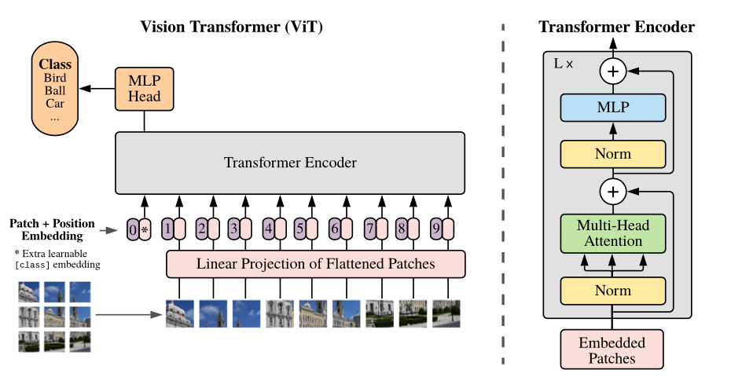

# Study Notebook

**Author:** Haozhe (Jimmy) Jia, Boston University

A collection of deep-learning study projects I built during my time in the
[Kolachalama Lab](https://vkola-lab.github.io/) at Boston University. Each
subproject reimplements a foundational architecture from scratch in PyTorch,
with notebooks that walk through every building block, verify tensor shapes at
each step, and visualize intermediate results. This repository doubles as my
portfolio of hands-on model implementations.

## Projects

### 1. [jimmy-gpt2](jimmy-gpt2/): GPT-2 from scratch

A from-scratch reimplementation of the GPT-2 transformer, weight-compatible
with HuggingFace's pretrained checkpoints.

- Core blocks built bottom-up: causal self-attention, GELU MLP, pre-LayerNorm
  transformer block, and the full GPT model (token and positional embeddings,
  block stack, LM head)
- Loads OpenAI's pretrained weights (`gpt2` through `gpt2-xl`) into the
  from-scratch model and generates text with top-k sampling
- Training forward pass with cross-entropy loss on Tiny Shakespeare, tokenized
  with `tiktoken`'s GPT-2 BPE encoder
- Walkthrough notebooks with per-module shape checks and pretrained-model
  experiments, including a look at how the token embedding shares weights with
  the LM head

See the project's own [README](jimmy-gpt2/README.md) for architecture details
and usage.

### 2. [ViT](ViT/): Vision Transformer from scratch

Study notes on the Vision Transformer ([Dosovitskiy et al., 2020](https://arxiv.org/abs/2010.11929)),
built up module by module in [`ViT_notes.ipynb`](ViT/ViT_notes.ipynb) and
trained end to end on MNIST.

<p align="center">
  
</p>
<p align="center">
  <em>The ViT architecture (Figure 1 of Dosovitskiy et al., 2020): an image is
  split into fixed-size patches, linearly embedded, combined with position
  embeddings and a learnable [class] token, fed through a standard transformer
  encoder, and classified from the [class] token by an MLP head.</em>
</p>

**Patch embedding**\
A strided `Conv2d` that maps an image `(B, C, H, W)` to a token sequence
`(B, num_patches, d_model)`, with visualizations of the image cut into patches
and a PCA-to-RGB view of the resulting embeddings.

**Positional encoding**\
A learnable `[CLS]` token prepended to the sequence, plus sinusoidal position
encodings from "Attention Is All You Need":

```math
PE_{(pos,\,2k)} = \sin\!\left(\frac{pos}{10000^{2k/d_{model}}}\right), \qquad
PE_{(pos,\,2k+1)} = \cos\!\left(\frac{pos}{10000^{2k/d_{model}}}\right)
```

Each position $pos$ gets a fixed vector of interleaved sines and cosines at
geometrically decreasing frequencies, added to the token embedding at the
input: $x'_{pos} = x_{pos} + PE_{pos}$.

**Transformer encoder**\
Multi-head self-attention (batched QKV projection,
`scaled_dot_product_attention` without a causal mask), a GELU MLP, and
pre-LayerNorm residual connections, stacked into encoder blocks.

**Classification**\
The full `VisionTransformer` classifies from the `[CLS]` token; a small config
(3 layers, 3 heads) trained for 5 epochs on MNIST reaches **92% test accuracy**.

## Repository structure

```
.
├── requirements.txt
├── jimmy-gpt2/                 # GPT-2 reimplementation (see its README)
│   ├── train_gpt2.py           # Full model, pretrained-weight loading, generation
│   ├── datasets/input.txt      # Tiny Shakespeare corpus
│   └── notebooks/              # Step-by-step walkthrough notebooks
└── ViT/
    ├── ViT_notes.ipynb         # ViT built module by module, trained on MNIST
    ├── vit_figure.png          # Architecture figure from the ViT paper
    └── *.jpeg                  # Sample image for the patch/embedding demos
```

MNIST downloads into an untracked `datasets/` directory at the repo root the
first time the ViT notebook runs.

## Setup

```bash
python -m venv .venv
source .venv/bin/activate
pip install -r requirements.txt
```

Then open any notebook with `jupyter notebook` and run it top to bottom.
