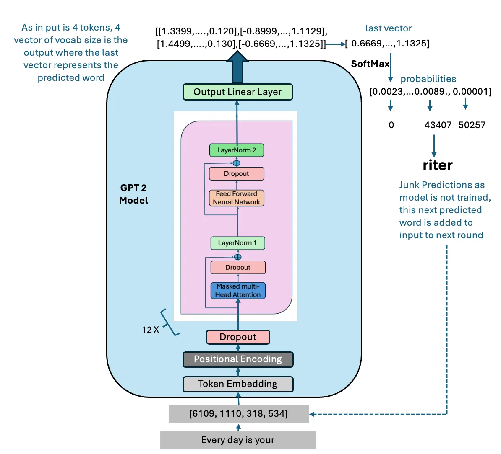

# Study Notebook

**Author:** Haozhe (Jimmy) Jia, Boston University

A collection of deep-learning study projects I built during my time in the
[Kolachalama Lab](https://vkola-lab.github.io/) at Boston University.
The subprojects focus on large-scale Transformer-based models in the NLP and
Computer Vision fields.

## Contents

- [Projects](#projects)
  - [1. jimmy-gpt2: GPT-2 from scratch](#1-jimmy-gpt2-gpt-2-from-scratch) (NLP)
  - [2. ViTransformer: Vision Transformer from scratch](#2-vitransformer-vision-transformer-from-scratch) (Computer Vision)
- [Datasets](#datasets)
- [Repository structure](#repository-structure)
- [Setup](#setup)

## Projects
### NLP Side:
#### 1. [jimmy-gpt2](jimmy-gpt2/): GPT-2 from scratch

A from-scratch reimplementation of the GPT-2 transformer, weight-compatible
with HuggingFace's pretrained checkpoints, following Andrej Karpathy's
["Let's reproduce GPT-2 (124M)"](https://www.youtube.com/watch?v=l8pRSuU81PU)
video.

<p align="center">
  
</p>
<p align="center">
  <em>The GPT-2 architecture: input tokens are embedded, combined with
  positional encodings, passed through 12 stacked transformer blocks (masked
  multi-head attention, feed-forward network, LayerNorm, residual connections),
  and projected to vocabulary logits whose softmax predicts the next token.
  Figure from
  <a href="https://medium.com/@vipul.koti333/from-theory-to-code-step-by-step-implementation-and-code-breakdown-of-gpt-2-model-7bde8d5cecda">"From
  Theory to Code: Step-by-Step Implementation and Code Breakdown of GPT-2
  Model"</a> by Vipul Koti.</em>
</p>

- Core blocks built bottom-up: causal self-attention, GELU MLP, pre-LayerNorm
  transformer block, and the full GPT model (token and positional embeddings,
  block stack, LM head)
- Loads OpenAI's pretrained weights (`gpt2` through `gpt2-xl`) into the
  from-scratch model and generates text with top-k sampling
- Training forward pass with cross-entropy loss on Tiny Shakespeare, tokenized
  with `tiktoken`'s GPT-2 BPE encoder
- Walkthrough notebooks with per-module shape checks and pretrained-model
  experiments, including a look at how the token embedding shares weights with
  the LM head

See the project's own [README](jimmy-gpt2/README.md) for architecture details
and usage.

### Computer Vision Side:
#### 2. [ViTransformer](ViTransformer/): Vision Transformer from scratch

Study notes on the Vision Transformer ([Dosovitskiy et al., 2020](https://arxiv.org/abs/2010.11929)),
built up module by module in [`ViT_notes.ipynb`](ViTransformer/ViT_notes.ipynb)
and trained end to end on MNIST. The core building blocks are extracted into an
importable [`vit/`](ViTransformer/vit/) package (patch embedding, positional
encoding, multi-head attention).

<p align="center">
  
</p>
<p align="center">
  <em>The ViT architecture (Figure 1 of Dosovitskiy et al., 2020): an image is
  split into fixed-size patches, linearly embedded, combined with position
  embeddings and a learnable [class] token, fed through a standard transformer
  encoder, and classified from the [class] token by an MLP head.</em>
</p>

**Patch embedding**\
A strided `Conv2d` that maps an image `(B, C, H, W)` to a token sequence
`(B, num_patches, d_model)`, with visualizations of the image cut into patches
and a PCA-to-RGB view of the resulting embeddings.

**Positional encoding**\
A learnable `[CLS]` token prepended to the sequence, plus sinusoidal position
encodings from "Attention Is All You Need":

$$
PE_{(pos,\,2k)} = \sin\!\left(\frac{pos}{10000^{2k/d_{model}}}\right), \qquad
PE_{(pos,\,2k+1)} = \cos\!\left(\frac{pos}{10000^{2k/d_{model}}}\right)
$$

Each position $pos$ gets a fixed vector of interleaved sines and cosines at
geometrically decreasing frequencies, added to the token embedding at the
input: $\text{x'}_{pos} = x_{pos} + PE_{pos}$.

**Transformer encoder**\
Multi-head self-attention (batched QKV projection,
`scaled_dot_product_attention` without a causal mask), a GELU MLP, and
pre-LayerNorm residual connections, stacked into encoder blocks.

**Classification**\
The full `VisionTransformer` classifies from the `[CLS]` token; a small config
(3 layers, 3 heads) trained for 5 epochs on MNIST reaches **92% test accuracy**.

## Datasets

**[Tiny Shakespeare](https://github.com/karpathy/char-rnn)** (jimmy-gpt2)\
A ~1 MB plain-text corpus of Shakespeare's plays, popularized by Andrej
Karpathy's char-rnn. Included in the repo at `jimmy-gpt2/datasets/input.txt`
and used for the GPT-2 training forward pass.

**[MNIST](https://en.wikipedia.org/wiki/MNIST_database)** (ViTransformer)\
The classic handwritten-digit dataset (60k train / 10k test, 28x28 grayscale)
created by Yann LeCun, Corinna Cortes, and Christopher J.C. Burges, and
introduced in ["Gradient-Based Learning Applied to Document Recognition"](http://yann.lecun.com/exdb/publis/pdf/lecun-98.pdf)
(LeCun et al., Proc. IEEE 1998), the LeNet-5 paper. Downloaded automatically
by `torchvision` into an untracked `datasets/` directory the first time the
ViT notebook runs, and used to train the ViT classifier.

## Repository structure

```
.
├── requirements.txt
├── jimmy-gpt2/                 # GPT-2 reimplementation (see its README)
│   ├── train_gpt2.py           # Full model, pretrained-weight loading, generation
│   ├── assets/GPT-2.webp       # Architecture figure (credit: Vipul Koti, Medium)
│   ├── datasets/input.txt      # Tiny Shakespeare corpus
│   └── notebooks/              # Step-by-step walkthrough notebooks
└── ViTransformer/
    ├── ViT_notes.ipynb         # ViT built module by module, trained on MNIST
    ├── vit/                    # Importable package of the core modules
    │   ├── patch_embed.py      # PatchEmbedding (strided-Conv2d patchifier)
    │   ├── pos_encoding.py     # [CLS] token + sinusoidal positional encoding
    │   └── attention.py        # Multi-head self-attention
    └── assets/                 # Static images
        ├── vit_figure.png      # Architecture figure from the ViT paper
        └── *.jpeg              # Sample image for the patch/embedding demos
```

## Setup

```bash
python -m venv .venv
source .venv/bin/activate
pip install -r requirements.txt
```

Then open any notebook with `jupyter notebook` and run it top to bottom.
